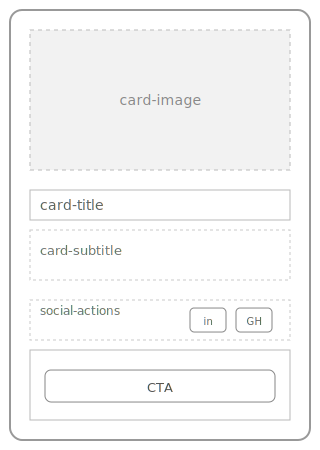
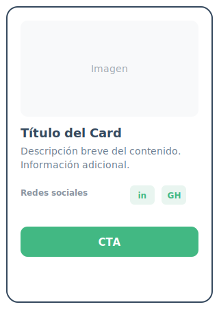

<p align="center">
  
</p>

# 🎨 Style Guide – Cohorte Vue

Sistema de diseño y lineamientos visuales oficiales para los componentes UI de **Cohorte Vue**.

Este documento define **estructura, jerarquía visual y reglas de uso**, con el objetivo de mantener consistencia entre diseño y desarrollo.

---

## 📌 1. Objetivo del Style Guide

- Establecer un lenguaje visual común
- Reducir ambigüedades entre diseño y desarrollo
- Facilitar la reutilización de componentes
- Servir como referencia viva dentro del repositorio

> Si no está documentado, no forma parte del sistema.

---

## 🧩 2. Componente: Card

El componente **Card** se utiliza para agrupar contenido relacionado y guiar al usuario hacia una acción principal (CTA).

---

## 🧱 3. Wireframe

El wireframe representa **la estructura base del componente**, sin estilos visuales finales.

- No define colores
- No define tipografía
- Se enfoca en jerarquía y layout



---

## 🎨 4. Mockup

El mockup aplica la **identidad visual de Cohorte Vue** sobre el wireframe.

- Paleta de colores oficial
- Jerarquía visual clara
- Diferenciación entre acciones principales y secundarias



---

## 🧠 5. Anatomía del Componente

```text
Card
├── Image
├── Title
├── Subtitle
├── Social Actions
│   ├── LinkedIn
│   └── GitHub
└── CTA (Call To Action)
```

## 6. Metodología de Estilo

- Nomenclatura CSS OOSS(Desarrollo), BEM(Mantenimiento)
- Organización CSS SMACSS(Trabajar por módulos)

## 7. Organización de Roles

- Documentación guía de estilos: EL gran YO
- Documentación README.md : Antonio "Vodanovic" Arriagada
- Diseñadores : Josseline Salas - Leonardo "Di Caprio" Valenzuela

## Paleta de Colores

- Primario #42b883
- Color dark #35495e
- Color Muted #6b7c8f
- Warning #FF5555
- Background soft #f9feff

## Fuentes Estandar

- Arial, Helvetica, Sans-serif

## Espaciado

- Espaciado SM 0.5 REM
- Espaciado medio MD 1 REM
- Espaciado LG 1.5 REM

## Bordes

- Border 0.5 EM
- Radius small 6 px
- Radius MD 8 px
- Radius large 16 px
